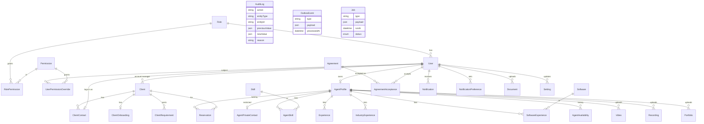
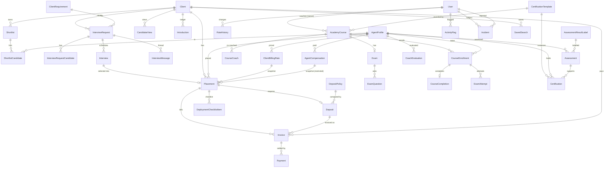

# Entity relationship diagram

All phases. Phase 0: identity, clients, agents, agreements, operations. Phase 1: marketplace (shortlists, views, introductions). Phase 2: interview requests, interviews, messages, placements, reservations, flags. Phase 3: academy (courses, exams, enrollments, assessments, certifications, verification requirements). Phase 4: commercial (billing rates, compensation, rate history, deposit policies, deposits, invoices, payments, deployment checklist). Phase 5: incidents, saved searches. Keep this file current when the Prisma schema changes.

## Notes on sensitive tables

| Table | Rule |
|---|---|
| `AgentPrivateContact` | Read requires `agent.read_private_contact`. Never joined into client-facing views (INV-P1). |
| `ClientContact.phone` | Never in agent-facing views (INV-P2). |
| `AuditLog` | Append-only. Trigger rejects UPDATE and DELETE (INV-I3). |
| `AgreementAcceptance` | Stores agreement version, body checksum, IP, and user agent (INV-I2). |
| `Reservation` | Partial unique index: one `ACTIVE` reservation per agent. |
| `Video`, `Recording`, `Portfolio` | Only `APPROVED` rows appear in client projections. `reviewFeedback` is never client-visible. |

## Planned (not yet in schema)

Phase 1: `Shortlist`, `ShortlistCandidate`, `CandidateView`, `Introduction`, `AdminNote`, `Session`.
Phase 2: `InterviewRequest`, `InterviewRequestCandidate`, `Interview`, `InterviewMessage`, `Placement`, `DeploymentChecklist*`, `Task`, `Incident`, `ActivityFlag`.
Phase 3: `AcademyCourse`, `CourseCoach`, `TrainingGroup*`, `CourseEnrollment`, `CourseCompletion`, `Assessment`, `AssessmentResultLabel`, `CoachEvaluation`, `CertificationTemplate`, `Certification`, `CertificationRequirement`, `VerificationRequirement`.
Phase 4: `ClientBillingRate`, `AgentCompensation`, `RateHistory`, `DepositPolicy`, `Deposit`, `Invoice`, `Payment`.

## Phases 1–5 additions

